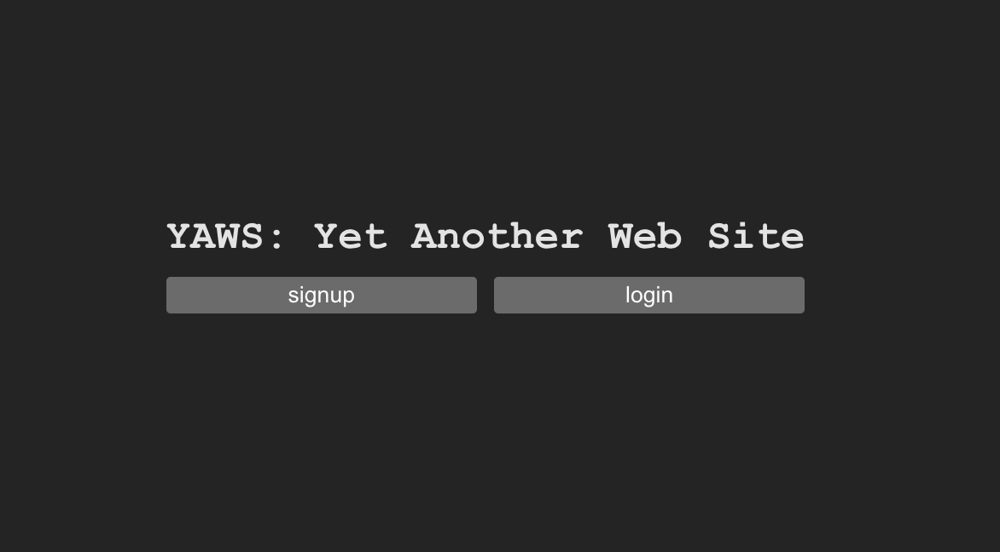

# Demo fullstack setup

Small repo to introduce Kysely (query builder), Nexus (gql server framework), Prisma (db schema framework), code-gen, and fullstack type-safety. Includes example integration with Firebase authentication.



## Authentication setup (one time only)

1. Create a [Firebase](https://firebase.google.com/) project

2. Create your "local development user"

   a. Go to `Project Overview` > `Authentication` > `Users` > `Add User` and manually create a user.

   b. Create client secrets folder `~/client/secrets/index.ts` and add the development user's info. Note that git ignores these.

   ```javascript
   export function secrets() {
     return {
       dev: {
         email: "EMAIL_HERE",
         password: "PASSWORD_HERE",
       },
     }
   }
   ```

3. Create server-side Firebase Admin credentials

   a. Go to `(Gear Icon)` > `Project settings` > `Service accounts` > `Firebase Admin SDK` > `Generate new private key` and create json credentials.

   b. Create server secrets folder `~/server/secrets/firebase-dev.json` and paste the json data in the file. Note that git ignores these.

4. Get your client credentials

   a. Go to `(Gear Icon)` > `Project settings` > `General` > `SDK setup and configuration` and copy the `firebaseConfig` data.

   b. Replace the firebase credentials in `~/client/src/config` with your own. These can be committed to git, they are meant to be public. Note: Do not change the name of the "firebase" key, just replace the object with your own.

## Start local development

Make sure you've [installed Docker](https://docs.docker.com/get-docker/) on your machine. After installation, make sure that docker is running on your machine.

From the root of the project, start the Docker container for the database:

```
$ docker-compose up -d
```

From the root of the project, this command starts all dev servers in parallel. If it the very first time you run the app, it will ask for confirmation to name and run migrations.

```
$ yarn dev
```

Development setup is ready when the terminal displays:

```
🟢 Server: http://localhost:4000/
```

The web client can be opened at:

```
http://127.0.0.1:5173/
```

The graphql client can be opened at:

```
https://studio.apollographql.com/sandbox/explorer
```

The database client can be opened at:

```
http://localhost:5555/
```

If authentication setup was done correctly, you should be able to click the `login` button and automatically get redirected to a mini CRUD panel.

## Stop local development

Cancel the terminal process started above. Note you will **lose all data** in the dtb if you stop the Docker container; if you wish to do so, run the below command to stop your container.

```
$ docker-compose down
```
